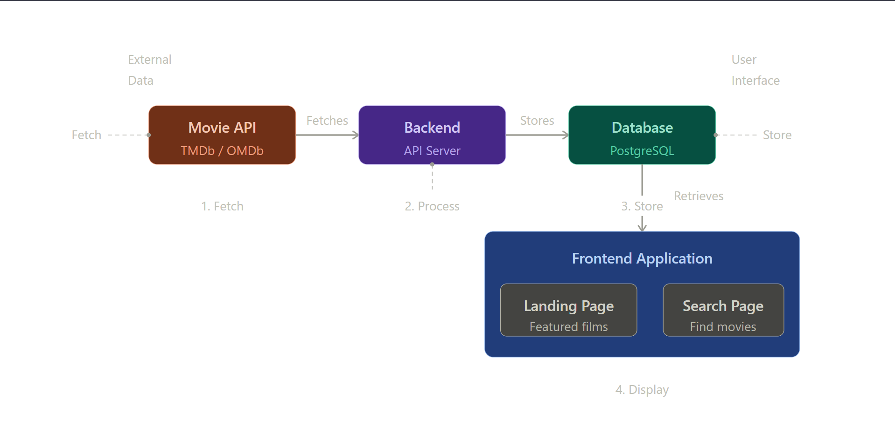

# MovieChronicle - Project Requirements

## Project Overview

MovieChronicle is a full-stack web application that collects movie data from external APIs, stores it in a database, and displays it through a user-friendly frontend interface. The application focuses on providing users with an intuitive way to discover and search for films.

---

## Technical Architecture

### System Structure




1. **External Movie API**: Fetch movie data (TMDb, OMDb, or similar)
2. **Backend Server**: Process and store API data
3. **Database**: Persist movie information
4. **Frontend**: Display and search functionality

---

## Frontend Requirements

### 1. Main Page (Landing Page)

**Purpose**: Welcome users and showcase featured films

**Features**:
- Hero section with site branding and tagline
- Featured films carousel or grid display
- Latest releases section
- Popular films section
- Quick navigation to search functionality
- Responsive design for mobile, tablet, and desktop
- Call-to-action buttons directing users to explore films
- Top-rated films showcase

**Design Elements**:
- Professional navigation bar with logo and menu items
- Footer with links, copyright information, and social media
- Film cards displaying: poster image, title, release year, rating
- Smooth animations and transitions
- Loading states for better user experience

**Technical Implementation**:
- HTML5 semantic markup
- CSS3 for styling and responsive layout
- JavaScript for interactivity
- Fetch data from backend API endpoints

### 2. Search Page

**Purpose**: Allow users to find films based on various criteria

**Features**:
- Search bar for film titles (live search or on-submit)
- Advanced filtering options:
  - Filter by genre
  - Filter by release year
  - Filter by rating/score
  - Filter by language
- Display search results in grid or list view
- Sort options:
  - Sort by release date (newest first)
  - Sort by rating (highest first)
  - Sort by popularity
  - Sort by title (A-Z)
- Pagination for large result sets
- "No results found" messaging with suggestions
- Recent searches display (optional)
- Clear search button to reset filters

**Design Elements**:
- Clean, intuitive search interface
- Clear filtering UI with checkboxes and dropdowns
- Result cards showing: poster, title, year, rating, synopsis preview
- Visual indicators for selected filters
- Mobile-optimised search experience

**Technical Implementation**:
- Axios or Fetch API for backend communication
- Query parameters for search and filtering
- Client-side filtering and sorting logic
- Debouncing for live search performance

---

## Backend Requirements

### 3. API Server

**Purpose**: Manage data flow between external APIs, database, and frontend

**Responsibilities**:
- Fetch data from external movie API
- Validate and transform API responses
- Store data in database
- Provide RESTful endpoints for frontend
- Handle authentication (if needed)
- Rate limiting to respect API quotas
- Error handling and logging

**Technology Stack**:
- Node.js with Express.js OR Python with Flask/Django
- RESTful API design
- Environment variables for API keys and configuration

**Required Endpoints**:
- `GET /api/movies` - Retrieve all movies (paginated)
- `GET /api/movies/:id` - Retrieve single movie details
- `GET /api/movies/search?query=...` - Search movies by title
- `GET /api/movies/filter?genre=...&year=...` - Filter movies
- `GET /api/genres` - Retrieve available genres
- `POST /api/movies/sync` - Sync data from external API (admin only)

---

## Database Requirements

### 4. Database Schema

**Technology**: PostgreSQL, MongoDB, or MySQL

**Core Collections/Tables**:

#### Movies Table
```
- id (Primary Key)
- title (String, required)
- description/synopsis (Text)
- release_date (Date)
- genre (Array/JSON or separate relation)
- rating (Decimal: 0-10)
- poster_url (String)
- backdrop_url (String)
- director (String)
- cast (Array/JSON)
- runtime (Integer - minutes)
- language (String)
- external_api_id (String - from TMDb/OMDb)
- popularity_score (Decimal)
- vote_count (Integer)
- created_at (Timestamp)
- updated_at (Timestamp)
```

#### Genres Table
```
- id (Primary Key)
- name (String, unique)
- description (Text)
```

#### Movies_Genres Junction Table
```
- movie_id (Foreign Key)
- genre_id (Foreign Key)
```

**Indexing**:
- Index on `title` for search performance
- Index on `release_date` for filtering
- Index on `rating` for sorting
- Index on `external_api_id` for API synchronisation

---

## Functional Requirements

### Data Collection

- **API Integration**: Successfully fetch movie data from chosen external API (TMDb recommended)
- **Data Synchronisation**: Regularly update database with new releases and information
- **Data Validation**: Ensure data integrity and consistency
- **Error Handling**: Gracefully handle API failures and invalid data
- **Rate Limiting**: Respect API rate limits and implement caching strategies

### Search Functionality

- **Title Search**: Find movies by partial or full title match
- **Case-Insensitive**: Search works regardless of letter case
- **Fast Retrieval**: Search results return within 1-2 seconds
- **Accurate Results**: Relevant results appear at the top
- **Pagination**: Handle large result sets efficiently

### Filtering Capabilities

- **Genre Filtering**: Single and multiple genre selection
- **Year Range**: Filter by specific year or year range
- **Rating Range**: Filter by minimum rating threshold
- **Language**: Filter by language preference
- **Combined Filters**: Apply multiple filters simultaneously

### Display & User Experience

- **Responsive Design**: Works on all device sizes (320px to 1920px+)
- **Fast Loading**: Page load time under 3 seconds
- **Accessibility**: WCAG 2.1 AA compliance
- **Performance**: Optimised images and lazy loading
- **Mobile-First**: Designed mobile experience first

---

## Non-Functional Requirements

### Performance

- Page load time: < 3 seconds
- Search response time: < 1 second
- Database query time: < 500ms
- API response time: < 2 seconds

### Security

- API keys stored in environment variables
- CORS properly configured
- Input validation and sanitisation
- SQL injection prevention (prepared statements)
- Rate limiting to prevent abuse

### Scalability

- Database optimisation for growing movie collection
- Caching strategy for frequently accessed data
- Pagination to limit data transfer
- CDN for static assets (images, CSS, JS)

### Reliability

- Error logging and monitoring
- Graceful degradation on API failures
- Database backup strategy
- Uptime target: 99.5%

---

## Technology Stack Recommendations

### Frontend

- **Framework**: React, Vue.js, or vanilla JavaScript
- **Styling**: CSS3, Tailwind CSS, or Bootstrap
- **HTTP Client**: Axios or Fetch API
- **State Management**: Redux, Vuex, or Context API (if needed)
- **Build Tool**: Webpack, Vite, or Parcel

### Backend

- **Runtime**: Node.js or Python 3.8+
- **Framework**: Express.js or Flask/Django
- **Database**: PostgreSQL (recommended) or MongoDB
- **ORM/ODM**: Sequelize, Prisma, or SQLAlchemy
- **Authentication**: JWT or Sessions

### External APIs

- **Primary**: The Movie Database (TMDb) - Free API
- **Alternative**: OMDb API
- **Alternative**: OMDB or IMDB datasets

### DevOps & Deployment

- **Version Control**: Git & GitHub
- **Hosting**: Heroku, Vercel, AWS, or similar
- **Environment Management**: dotenv
- **Documentation**: Markdown files

---

## Development Phases

### Phase 1: Setup & Core
- [ ] Project structure and dependencies setup
- [ ] Database schema design and creation
- [ ] Backend API development for basic CRUD operations
- [ ] External API integration and data fetching
- [ ] Initial database population

### Phase 2: Frontend Development
- [ ] Landing page design and development
- [ ] Search page implementation
- [ ] Search and filter functionality
- [ ] Responsive design implementation
- [ ] Frontend testing

### Phase 3: Enhancement
- [ ] Advanced filtering options
- [ ] Sorting functionality
- [ ] Pagination implementation
- [ ] Performance optimisation
- [ ] Caching strategies

### Phase 4: Polish & Deployment
- [ ] Bug fixes and testing
- [ ] Security review
- [ ] Documentation completion
- [ ] Deployment to production
- [ ] Monitoring and maintenance setup

---

## Documentation Requirements

- **README.md**: Project overview, setup instructions, and usage guide
- **API Documentation**: Endpoint specifications and examples
- **Database Schema**: Entity-relationship diagrams and descriptions
- **Installation Guide**: Step-by-step setup instructions
- **Contribution Guidelines**: For potential contributors
- **Deployment Guide**: Instructions for deploying to production

---

## Testing Requirements

- **Unit Tests**: Backend logic and utility functions
- **Integration Tests**: API endpoints and database operations
- **Frontend Tests**: Component functionality and user interactions
- **End-to-End Tests**: Complete user workflows
- **Minimum Coverage**: 70% code coverage

---

## Success Criteria

- ✓ Application successfully fetches and stores movie data
- ✓ Landing page displays featured films attractively
- ✓ Search functionality works accurately and quickly
- ✓ Filtering options function correctly
- ✓ Application is fully responsive on all devices
- ✓ Code is well-documented and maintainable
- ✓ Application performs well under normal load
- ✓ Users can complete their workflow intuitively

---

## Future Enhancements (Post-MVP)

- User accounts and authentication
- Watchlist and favourite films functionality
- User ratings and reviews
- Social sharing features
- Recommendation engine
- Advanced analytics
- Mobile application
- Multiple language support
- Dark mode theme

---

**Version**: 1.0  
**Last Updated**: May 2026  
**Status**: Ready for Development
